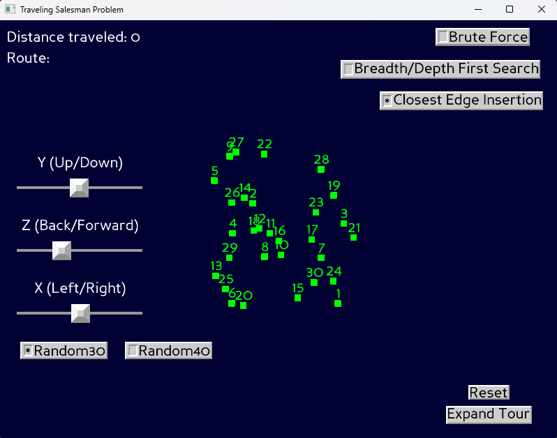

# Traveling Salesman Problem (TSP) Visualization (Panda3D)

An interactive visualization of the Traveling Salesman Problem built with Panda3D. The app now supports two modes:
- Brute Force (BF): enumerate permutations for small instances and sort by total distance.
- First Search (FS): explore a graph of predefined directed stops using Breadth-First Search (BFS) or Depth-First Search (DFS) to find the first route from a chosen start city to a chosen destination.

## Features
- Visualizes TSP-style nodes from .tsp files (TSPLIB-like format with NODE_COORD_SECTION).
- Two modes of operation:
  - Brute Force — generate all routes for bundled BF problems; results saved to results/.
  - First Search — interactively choose Start and Final cities, then either step through valid Stops or click "Generate Routes" to compute the first path using BFS/DFS.
- Built-in mode switcher: "Brute Force" and "Breadth/Depth First Search" radio buttons.
- In First Search: on-screen labels show Starting City and Final City; BFS/DFS toggle via radio buttons.
- Click cities to build your own route (BF mode) or to set Start/Final city (FS mode) and see cumulative Euclidean distance.
- Buttons to switch between bundled instances per mode.
- Zoom sliders for panning/zooming the scene.
- Clean Panda3D GUI (DirectGUI) with on-screen distance and route displays.

## Project Structure
- main.py — App entry point, window setup, and mode selection buttons.
- src/ 
  - TSP.py — Simple TSPLIB-like parser and data model.
  - Map.py — Scene graph, city placement, selection, route generation, and UI elements.
  - City.py — City node model and label.
  - bus/ — Distance accumulation and stop geometry.
    - Bus.py — Tracks total distance for the current route and displays it.
    - Stop.py — Visual/logic for selectable directed edges used by FS mode.
  - modes/
    - Mode.py — Common mode utilities and file button generation. Loads from src/tsp/<MODE>.
    - BruteForceMode.py — Brute force interaction and result generation (BF mode).
    - FirstSearchMode.py — BFS/DFS logic, Start/Final selection, Stop navigation (FS mode).
  - tsp/
    - BF/ — Sample brute-force instances (Random4.tsp … Random12.tsp).
    - FS/ — Sample first-search instance(s) (e.g., 11PointDFSBFS.tsp) with predefined Stops.
- results/ — Output directory for brute-force results (txt files).
- config.prc — Panda3D config (e.g., window title).
- requirements.txt — Python dependencies.

## Requirements
- Python 3.13+
- Panda3D 1.11+

Install dependencies:
- python -m pip install --upgrade pip
- pip install -r requirements.txt

## Running the App
From the project root (same folder as main.py):
- python main.py

Notes:
- The app loads config.prc automatically for the window title and settings.
- Default problem depends on the active mode when the app starts. By default, the app starts in First Search mode with src/tsp/FS/11PointDFSBFS.tsp.

## Modes and Interaction

### Switching Modes
- Use the radio buttons in the upper-right:
  - "Brute Force"
  - "Breadth/Depth First Search"
- Each mode shows a grid of radio buttons (lower-left) listing available .tsp files for that mode’s directory (src/tsp/BF or src/tsp/FS). Selecting a file loads it.

### First Search (BFS/DFS)
- Goal: Find a path from a Starting City to a Final City using only predefined directed Stops.
- Steps:
  1) Click a city to set the Starting City.
  2) Click a different city to set the Final City. The on-screen labels update.
  3) Navigate by clicking visible Stops (small connectors) that are valid from your current city. Invalid clicks are ignored with a warning.
  4) Alternatively, press "Generate Routes" to automatically compute and display the first route found from Start to Final:
     - If the BFS radio is selected, BFS explores level by level.
     - If the DFS radio is selected, DFS explores depth-first.
     - The first found route is drawn on the map and the route is marked complete.
- Controls in FS mode:
  - Radio buttons: "BFS" and "DFS" to choose the search.
  - Generate Routes: disabled until a Final City is set; when pressed, computes the first path and displays it.
  - Reset: clears Start/Final city, route, and any selected Stops.

### Brute Force
- Click cities to build a route in order; distance accumulates.
- Switch BF instances using the file buttons in the lower-left (Random4 … Random12).
- Press "Generate Routes" to enumerate all permutations for the current instance and write sorted distances to results/\<NAME\>.txt and timing to results/\<NAME\>_time.txt.
- Reset clears the current route and distance.

## Route Distance
- Uses Euclidean distance on node coordinates from the loaded .tsp file.
- Distance accumulates as you select cities in order; there is no implicit return to the start unless you explicitly select it.

## Results Output (Brute Force mode)
- When you click Generate Routes in BF mode, the app enumerates all permutations and writes a sorted list by distance to results/\<NAME\>.txt, and the execution time to results/\<NAME\>_time.txt, for example:
  - results/concorde4.txt
  - results/concorde4_time.txt
- The non-suffixed file includes each route’s total distance; the _time file contains the execution time for writing/sorting results.

## TSP File Format
This app expects a minimal TSPLIB-like format with at least:
- NAME: <identifier>
- TYPE: TSP
- DIMENSION: <n>
- NODE_COORD_SECTION
- One line per node: <index> <x> <y>

Updated: 2025-09-06

*README.md updated by Junie, the AI coding agent by JetBrains.*
